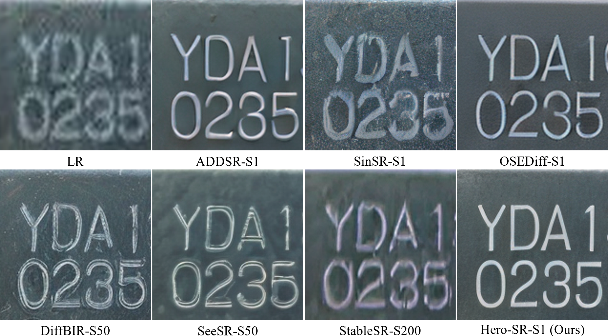
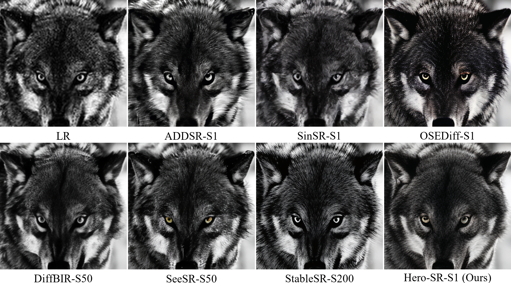
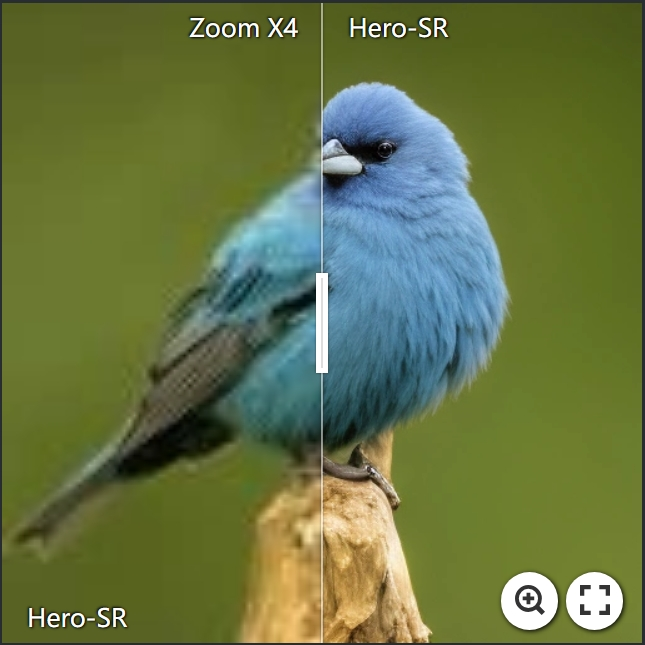
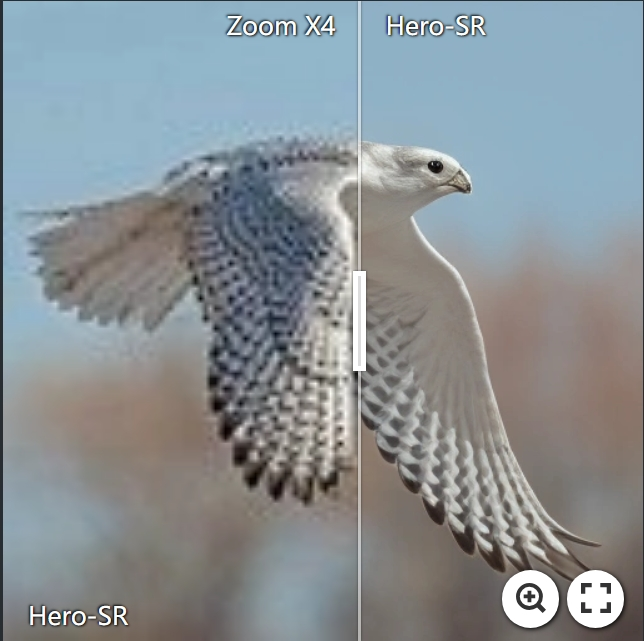
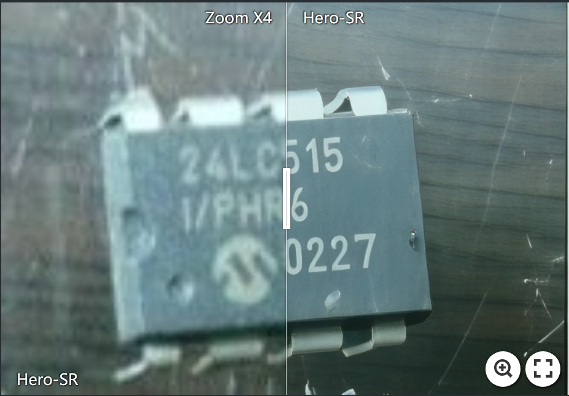
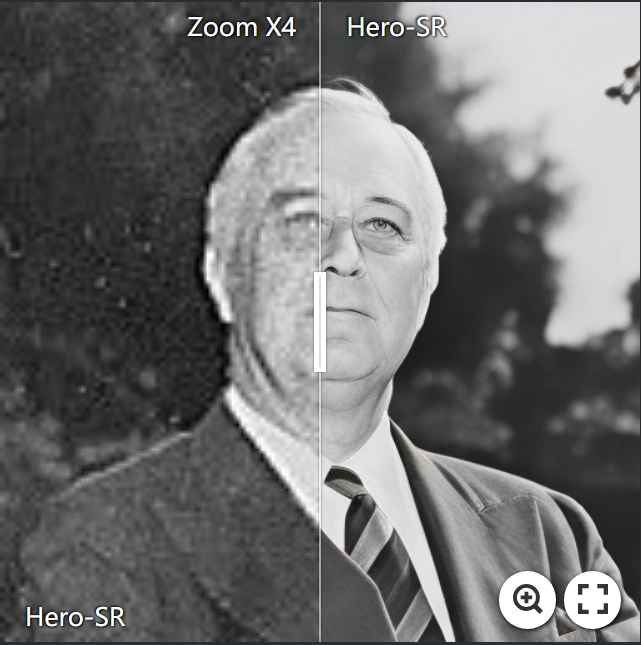

# **Hero-SR: One-Step Diffusion for Super-Resolution with Human Perception Priors**  

**Jiangang Wang | [Qingnan Fan](https://fqnchina.github.io/) | [Qi Zhang](https://qzhang-cv.github.io/) | Haigen Liu | Yuhang Yu | Jinwei Chen | [Wenqi Ren](https://rwenqi.github.io/)**  

> **Shenzhen Campus of Sun Yat-sen University**  
> **vivo Mobile Communication Co. Ltd**  

---

[](https://arxiv.org/abs/2412.07152)    


⭐ If you find **Hero-SR** useful for your research or projects, please **star** this repository to support our work. Thanks! 😊  


---
### **📜 Abstract**
> Owing to the robust priors of diffusion models, recent approaches have shown promise in addressing real-world super-resolution (Real-SR). However, achieving semantic consistency and perceptual naturalness to meet human perception demands remains difficult, especially under conditions of heavy degradation and varied input complexities. To tackle this, we propose Hero-SR, a one-step diffusion-based SR framework explicitly designed with human perception priors. Hero-SR consists of two novel modules: the Dynamic Time-Step Module (DTSM), which adaptively selects optimal diffusion steps for flexibly meeting human perceptual standards, and the Open-World Multi-modality Supervision (OWMS), which integrates guidance from both image and text domains through \addtext{a multimodal model} to improve semantic consistency and perceptual naturalness. Through these modules, Hero-SR generates high-resolution images that not only preserve intricate details but also reflect human perceptual preferences. Extensive experiments validate that Hero-SR achieves state-of-the-art performance in Real-SR.

---

## **📢 Updates**
- **2025/03/19**: Released the **test code**.
---

## **📝 To-Do List**
- ~~Release test code~~  
- Release training code  
---


## **📸 Visual Comparison**
<p align="center">
     
</p>


### Click on any image to **view the interactive comparison**:

<!-- 
[](https://imgsli.com/MzYwNzAw)
[](https://imgsli.com/MzYwNzAx)

[](https://imgsli.com/MzYwNzAy)
[](https://imgsli.com/MzYwNzAz)
 -->

<p align="center">
    <a href="https://imgsli.com/MzYwNzAw"></a>
    <a href="https://imgsli.com/MzYwNzAx"></a>
        <br> <!-- 这里插入换行 -->
    <a href="https://imgsli.com/MzYwNzAy"></a>
    <a href="https://imgsli.com/MzYwNzAz"></a>
</p>
---

## **📦 Requirements**
Set up the environment:  
```bash
conda create -n Hero-SR python=3.10
conda activate Hero-SR
pip install -r requirements.txt
```

---

## **🚀 Quick Inference**
### **1️⃣ Download Pretrained Models**
- **Hero-SR Model:** [Google Drive Link](https://drive.google.com/file/d/1xxY2vYdn6-yjg7_7op5y4d1u2iOYRifs/view?usp=sharing)  
  ```bash
  mv hero_sr_model.pkl checkpoint/hero_sr_model.pkl
  ```
- **Stable Diffusion Turbo:** [Hugging Face Link](https://huggingface.co/stabilityai/sd-turbo)  


### **2️⃣ Run Inference**
```bash
python test.py \
--sd_model_name_or_path sd-turbo \
--pretrained_model_path checkpoint/hero_sr_model.pkl \
--input_dir preset/test_image \
--output_dir result/test_image  \
--align_method adain
```

---

## **📊 Reproducing Paper Results**
### **1️⃣ Download Benchmark Datasets**
To reproduce the results, download the following benchmark datasets from **StableSR**:  
[DRealSR, RealSR, and DIV2K](https://huggingface.co/datasets/Iceclear/StableSR-TestSets/tree/main)  

### **2️⃣ Test on Benchmark Datasets**
```bash
python test.py \
--sd_model_name_or_path sd-turbo \
--pretrained_model_path checkpoint/hero_sr_model.pkl \
--input_dir dataset/RealSR_CenterCrop/test_LR \
--output_dir result/RealSR \
--align_method adain \
--upscale_factor 4
```

### **3️⃣ Evaluate Performance**
To compute evaluation metrics:
```bash
CUDA_VISIBLE_DEVICES=0 python metric_img.py \
--hq_folder result/RealSR \
--gt_folder dataset/RealSR_CenterCrop/test_HR \
--metric_path result/result.csv \
--batch_size 1
```

---

## **🙌 Acknowledgements**
This project builds upon **[Diffusers](https://github.com/huggingface/diffusers)** and **[Img2Img-Turbo](https://github.com/GaParmar/img2img-turbo)**. Special thanks to the developers for their fantastic contributions to the open-source community. 🎉  

---

## **📄 Paper Access**
If you have trouble accessing the paper on arXiv, you can download it directly from **Google Drive**:  📄 **[Hero-SR PDF](https://drive.google.com/file/d/1MAo5SvEvqlFPd-vwUq6w6-M6dvNgAcdY/view?usp=sharing)**  

---

## **📖 Citation**
If you find this work helpful, please cite it using the following format:  
```bibtex
@article{hero-sr,
  title={Hero-SR: One-Step Diffusion for Super-Resolution with Human Perception Priors},
  author={Jiangang Wang, Qingnan Fan, Qi Zhang, Haigen Liu, Yuhang Yu, Jinwei Chen, Wenqi Ren},
  year={2024}
}
```

---

## **📧 Contact**
For any questions or collaboration opportunities, feel free to reach out:  
📩 **Email:** [wangjg33@mail2.sysu.edu.cn](mailto:wangjg33@mail2.sysu.edu.cn)  
Alternatively, you can open an **issue** on GitHub.

---
